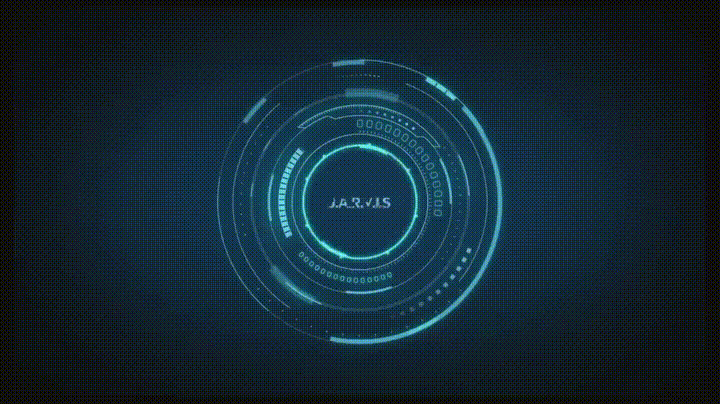
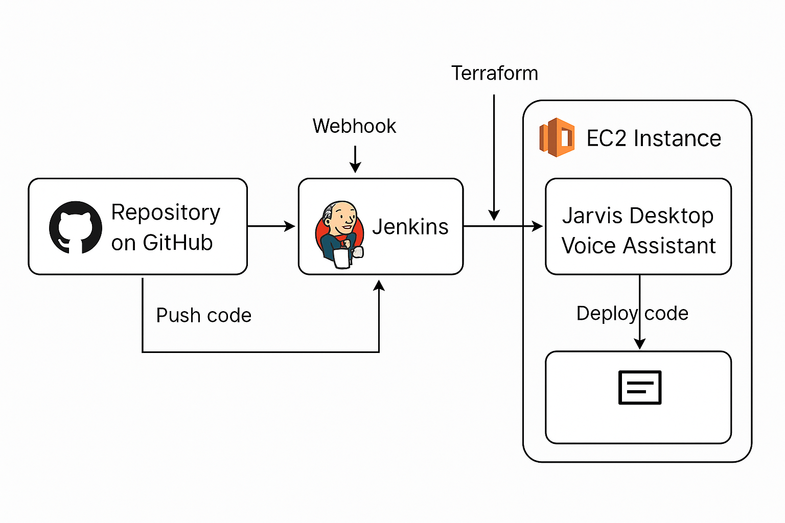
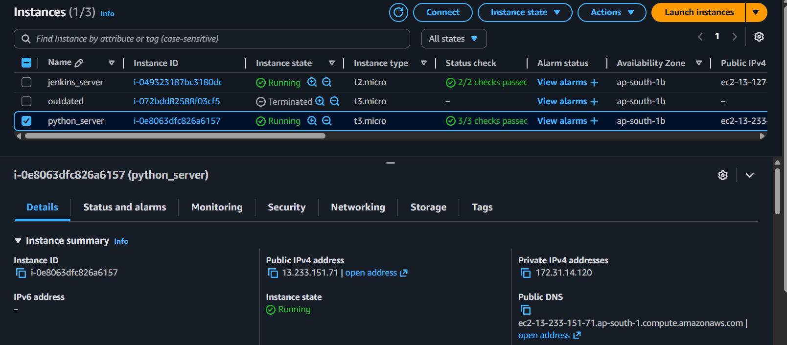
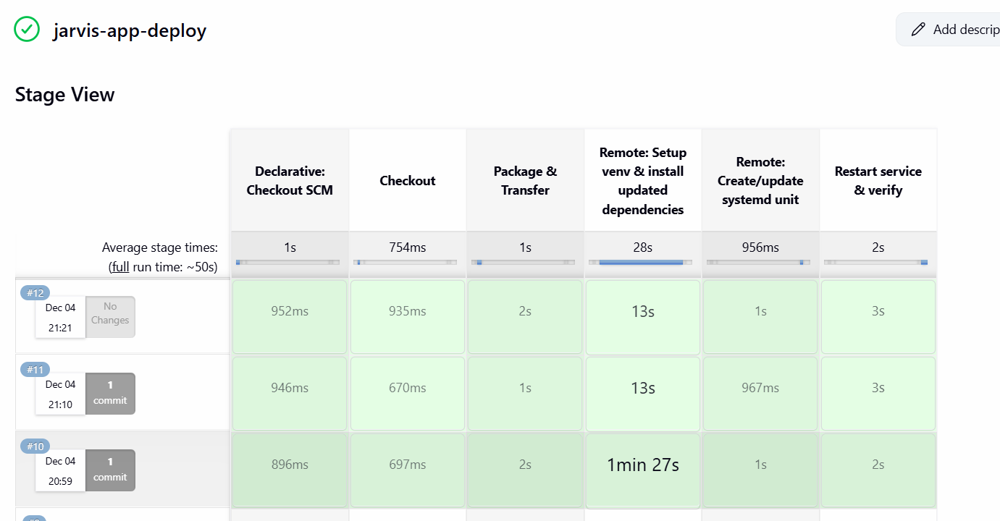

# Jarvis Desktop Voice Assistant Deployment Using Terraform, Jenkins, and AWS EC2

---

## Project Summary

This project deploys the Jarvis Desktop Voice Assistant (a Python application) on an AWS EC2 instance.
The entire infrastructure is created using Terraform, and the deployment is automated using Jenkins.
Whenever a new update is pushed to GitHub, Jenkins pulls the latest code and redeploys it to the EC2 instance.

This creates a complete CI/CD workflow for a Python desktop-style application running on a Linux server.

---

## What This Project Does

Creates an EC2 instance using Terraform

Sets up security group and key pair

Connects Jenkins with the EC2 instance

Pulls the Jarvis application code from GitHub

Installs Python packages and dependencies on EC2

Creates and maintains a Python virtual environment

Configures a systemd service to run the Jarvis app

Automatically redeploys when code is updated

---

## Architecture Overview

Developer pushes code to GitHub

GitHub Webhook triggers Jenkins

Jenkins pulls the latest code

Jenkins connects to EC2 using SSH

Dependencies are installed inside the virtual environment

The systemd service is restarted

Jarvis app runs with the updated version

---

## Terraform Setup

Terraform was used to create only the infrastructure.
The following resources were created:

EC2 instance (Ubuntu Server)

Security Group allowing SSH

Key Pair for EC2 access

---

### Files used:

main.tf

variables.tf

These files launch the server and prepare it for Jenkins-based deployment.

---

### Jenkins Setup

A separate Jenkins server was created manually.
The following steps were done:

Installed Jenkins on a different EC2 instance

Added SSH credentials (private key) to connect to the target EC2

Configured a Jenkins Pipeline

Added GitHub Webhook to trigger builds automatically

Created a full deployment pipeline using Jenkinsfile

---

### Jenkins Pipeline Stages

 The Jenkinsfile performs all automation:

1. Checkout Code

Pulls the latest code from the GitHub repository.

2. Transfer Application Files

Uses SSH and Rsync to copy the project to the EC2 machine.

3. Install Dependencies

Creates a Python virtual environment and installs:

Python dependencies

SpeechRecognition

PyAudio

PyAutoGUI

Wikipedia

Other required packages

4. Create or Update systemd Service

A systemd unit file is created so the app runs automatically:

Starts Jarvis at boot

Restarts on failure

Uses xvfb-run to support GUI functions

5. Restart and Verify the Service

The service is restarted after every update and logs are checked.

Deployment Flow

Push your code to GitHub

GitHub notifies Jenkins

Jenkins pulls the code

Jenkins deploys it to EC2

Your Jarvis app restarts with the new version

---

## Result

A fully automated pipeline where:

Terraform builds the infrastructure

Jenkins deploys the application

EC2 hosts and runs the Jarvis Desktop Voice Assistant continuously